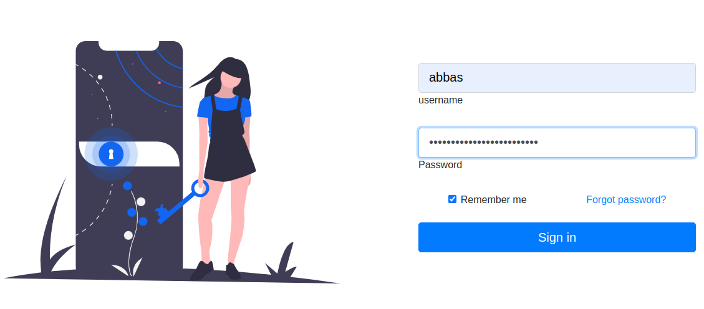

## WebFace

## About The Project:

WebFace is a reverse proxy that is designed to secure unsecure apps on kubernetes and protect apps with passwords that reads from microsoft active directory. It deploys as a sidecar container and authenticate/authorize users by AD using Ldap/Ldaps.
It has two kind of authentication method:

-   BasicAuth
-   Login form



Some example of apps that tested against webface successfully:

-   Kuberntes dashboard
-   Phpmyadmin
-   Kafka-ui
-   Filebrowser
-   Kibana
-   Prometheus

    

## How to Use It:

Download [webFace helmchart](https://github.com/Abbas-gheydi/webface/tree/main/deploy).
Modify envs on [value.yaml](https://github.com/Abbas-gheydi/webface/blob/main/deploy/helm/values.yaml) file.
run
```
Helm install exampleSecureApp ./
```  
## Example:

This is a example setting for domain “test.local” and domain controller ip address “192.168.1.1 “and allowed groups is “kafka_users” and kubernetes service is redpanda:8080:

```
- name: UPSTREAM
  value: "[http://redpanda:8080]"
- name: LDAP_SERVER
  value: "192.168.1.1"
- name: LDAP_PORT
  value: "389"
- name: LDAP_SEC_LEVEL
  value: "4"
- name: LDAP_BASEDN
  value: "DC=test,DC=local"
- name: LDAP_GROUP
  value: "kafka_users"
```


